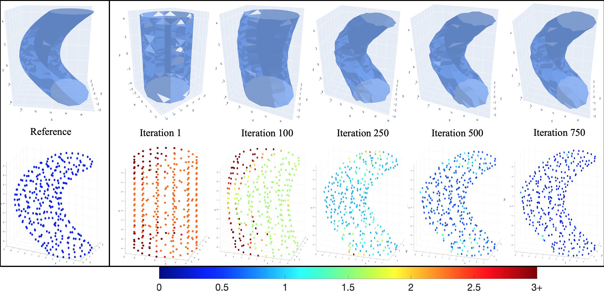

# ReMiDi - Reconstruction of Microstructure using Diffusion Magnetic Resonance Imaging

ReMiDi is a framework for reconstructing complex microstructural geometries using diffusion MRI data.

## Paper

For more details about the method and its implementation, please refer to our paper:
[Reconstruction of Microstructure using Diffusion Magnetic Resonance Imaging](https://arxiv.org/abs/2502.01988)

## Method Overview




## Running Experiments

Current setup provides three different reconstruction experiments: bending, beading, and fanning. Each experiment can be run using its corresponding configuration file.

### Using Docker

The recommended way to run ReMiDi is using our Docker image:

```bash
docker pull prattk/remidi:v1.0.1
```

### Reconstruction Examples

1. Bending Reconstruction:
```bash
python3 bending_reconstruction.py config/bending_reconstruction_conf.json
```

2. Beading Reconstruction:
```bash
python3 beading_reconstruction.py config/beading_reconstruction_conf.json
```

3. Fanning Reconstruction:
```bash
python3 fanning_reconstruction.py config/fanning_reconstruction_conf.json
```

## Output

The reconstruction process generates:
- Intermediate mesh files in `.html` format for visualization
- Image files showing the reconstruction progress
- Video files for the entire reconstruction process will also be generated and saved in the same folder.

These outputs are automatically saved in the output directory specified in the configuration files.

## Citation

If you use ReMiDi in your research, please cite our paper:

```bibtex
@misc{khole2025remidireconstructionmicrostructureusing,
      title={ReMiDi: Reconstruction of Microstructure Using a Differentiable Diffusion MRI Simulator}, 
      author={Prathamesh Pradeep Khole and Zahra Kais Petiwala and Shri Prathaa Magesh and Ehsan Mirafzali and Utkarsh Gupta and Jing-Rebecca Li and Andrada Ianus and Razvan Marinescu},
      year={2025},
      eprint={2502.01988},
      archivePrefix={arXiv},
      primaryClass={eess.IV},
      url={https://arxiv.org/abs/2502.01988}, 
}
```